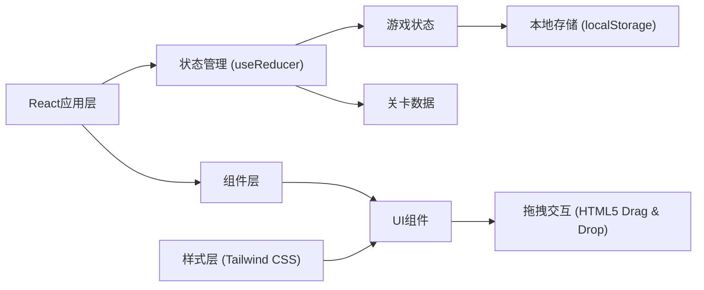

# 工位调度大师 - 技术架构文档

## 1. 架构设计



## 2. 技术描述

- **前端框架**：React@18 + TypeScript
- **构建工具**：Vite
- **样式方案**：Tailwind CSS@3
- **拖拽实现**：HTML5 Drag & Drop API
- **状态管理**：React useReducer + Context
- **数据存储**：localStorage
- **路由**：React Router（或使用状态切换实现简单路由）

## 3. 页面路由

| 路由 | 页面组件 | 功能 |
|-----|---------|------|
| / | MainMenu | 主菜单页面 |
| /game/:levelId | GamePage | 游戏主界面 |
| /result | ResultPage | 结算页面 |
| /tutorial | TutorialPage | 教程页面 |
| /scores | ScoresPage | 成绩记录页面 |

## 4. 数据模型

### 4.1 关卡数据结构

```typescript
interface Level {
  id: number;
  name: string;
  description: string;
  duration: number; // 游戏时长(秒)
  stationCount: number; // 工位数量
  events: GameEvent[]; // 事件列表
  unlockScore: number; // 解锁下一关所需分数
}

interface GameEvent {
  type: 'missing_material' | 'severe_dirt' | 'guide_delay' | 'early_arrival';
  time: number; // 触发时间(秒)
  stationId?: number; // 影响的工位ID
  description: string;
}
```

### 4.2 工位状态

```typescript
interface Station {
  id: number;
  name: string;
  cleanliness: number; // 0-100 清洁度
  materialStatus: 'full' | 'partial' | 'empty' | 'missing';
  isCritical: boolean; // 是否为关键工位
  isDirty: boolean; // 是否污损严重
  currentTask: Task | null;
}
```

### 4.3 任务结构

```typescript
interface Task {
  id: string;
  type: 'clean' | 'refill';
  stationId: number;
  priority: 'high' | 'medium' | 'low';
  duration: number; // 执行时长(秒)
  progress: number; // 0-100 进度
  status: 'pending' | 'in_progress' | 'completed';
}
```

### 4.4 评分结构

```typescript
interface Score {
  levelId: number;
  timestamp: number;
  cleanRate: number; // 清理完成率
  refillAccuracy: number; // 补料准确率
  delayDuration: number; // 延误时长
  stationUtilization: number; // 工位利用率
  totalScore: number;
  stars: number; // 1-3星
}
```

## 5. 核心组件

### 5.1 容器组件

- `App.tsx` - 根组件，路由管理
- `GameContainer.tsx` - 游戏容器，管理游戏状态

### 5.2 页面组件

- `MainMenu.tsx` - 主菜单
- `LevelSelect.tsx` - 关卡选择
- `GamePage.tsx` - 游戏主界面
- `ResultPage.tsx` - 结算页面
- `TutorialPage.tsx` - 教程页面
- `ScoresPage.tsx` - 成绩页面

### 5.3 游戏组件

- `TimerBar.tsx` - 倒计时条
- `StationPanel.tsx` - 工位状态面板
- `TaskList.tsx` - 任务清单（可拖拽）
- `TaskItem.tsx` - 任务项
- `EventNotification.tsx` - 事件通知
- `ControlPanel.tsx` - 控制面板

## 6. 状态管理

使用 React Context + useReducer 管理游戏状态：

```typescript
interface GameState {
  currentLevel: Level | null;
  gameStatus: 'idle' | 'playing' | 'paused' | 'finished';
  timeRemaining: number;
  stations: Station[];
  tasks: Task[];
  activeEvents: GameEvent[];
  score: Score | null;
}
```

## 7. 本地存储

保存以下数据到 localStorage：

- 已解锁关卡
- 各关卡最佳成绩
- 历史记录
